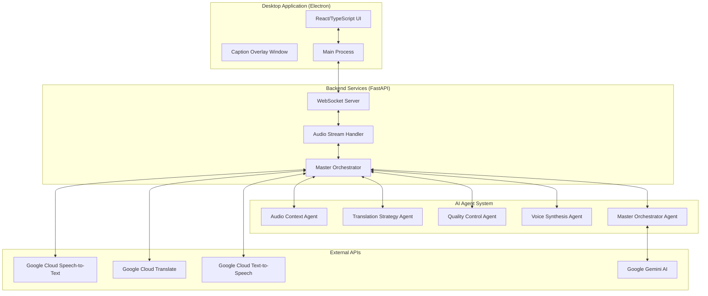
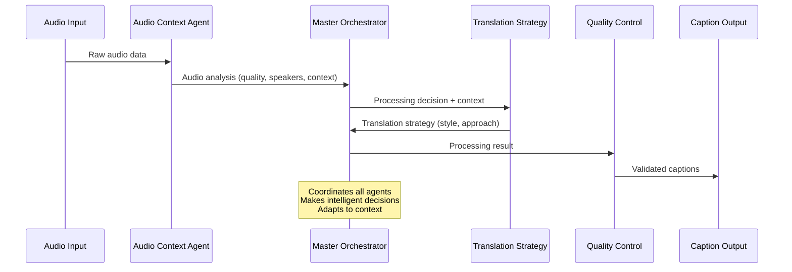

# SpeakTogether 🌍🎙️
### AI-Powered Real-Time Audio Captions & Translation Desktop App

[](https://opensource.org/licenses/MIT)
[](https://www.python.org/downloads/)
[](https://nodejs.org/)
[](https://electronjs.org/)
[](https://fastapi.tiangolo.com/)

**SpeakTogether** is a sophisticated desktop application that provides real-time audio transcription, translation, and captioning with an innovative **multi-agent AI orchestration system**. Perfect for meetings, educational content, entertainment, and accessibility needs.


## 🚀 Key Features

### 🎯 **Real-Time Audio Processing**
- **Live Audio Capture**: PyAudio integration for microphone and system audio
- **Instant Transcription**: Google Cloud Speech-to-Text with sub-second latency
- **Smart Buffering**: Intelligent audio buffering with silence detection
- **High-Quality Processing**: 16kHz sampling rate with noise reduction

### 🌐 **Advanced Translation Engine**
- **100+ Languages Supported**: Comprehensive Google Translate language coverage
- **Hybrid Translation Pipeline**: Instant rules + AI enhancement for optimal speed/quality
- **Multi-Language Detection**: Automatic source language identification
- **Cultural Adaptation**: Context-aware translation with formal/casual styles

### 🤖 **Multi-Agent AI Orchestration**
Revolutionary AI system with **5 specialized agents** working together:

1. **🎵 Audio Context Agent**: Analyzes audio source, quality, and speaker characteristics
2. **🧠 Master Orchestrator**: Coordinates all agents and makes high-level processing decisions
3. **🔄 Translation Strategy Agent**: Determines optimal translation approach and style
4. **✅ Quality Control Agent**: Validates results and triggers reprocessing when needed
5. **🎤 Voice Synthesis Agent**: Creates natural voice dubbing with speaker matching

### 📱 **Beautiful Desktop Interface**
- **Modern Electron App**: Cross-platform desktop application (macOS, Windows, Linux)
- **Real-Time Dashboard**: Live monitoring of AI agent decisions and processing
- **Bilingual Caption Overlay**: Always-on-top caption window with dual-language display
- **Intuitive Controls**: One-click audio capture, language selection, and settings

### 🎨 **Caption Overlay System**
- **Always-On-Top Window**: Floating captions that stay above all applications
- **Bilingual Display**: Side-by-side original and translated text
- **Smart Positioning**: Automatic screen positioning with user customization
- **Confidence Indicators**: Visual feedback for transcription and translation quality
- **Real-Time Updates**: Sub-100ms caption updates with smooth animations

## 🏗️ Architecture Overview

### 📊 **System Architecture**



### 🔄 **Multi-Agent Processing Pipeline**



### 💾 **Technology Stack**

#### **Frontend (Desktop App)**
- **Framework**: Electron 27.x with React 19
- **Language**: TypeScript with strict type checking
- **Styling**: Tailwind CSS with custom animations
- **UI Components**: Radix UI primitives for accessibility
- **State Management**: React hooks with optimized WebSocket integration
- **Build System**: Vite for fast development and optimized builds

#### **Backend (API Server)**
- **Framework**: FastAPI 0.115+ with async/await throughout
- **Language**: Python 3.9+ with type hints
- **WebSockets**: Native FastAPI WebSocket support for real-time communication
- **Audio Processing**: PyAudio for cross-platform audio capture
- **AI Integration**: Google ADK, Gemini AI for intelligent agent orchestration
- **Logging**: Structured logging with colorized output

#### **AI & Cloud Services**
- **Speech Recognition**: Google Cloud Speech-to-Text API
- **Translation**: Google Cloud Translate API with 100+ language support
- **AI Enhancement**: Google Gemini 1.5 Pro/Flash for intelligent processing
- **Voice Synthesis**: Google Cloud Text-to-Speech (planned feature)

## 🎛️ **Detailed Feature Breakdown**

### 🎙️ **Audio Capture System**

The audio capture system supports multiple input sources with intelligent processing:

```python
# Audio Configuration
AUDIO_SAMPLE_RATE = 16000    # Optimal for speech recognition
AUDIO_CHUNK_SIZE = 1024      # Balance latency vs. processing efficiency
AUDIO_CHANNELS = 1           # Mono for better speech processing

# Smart Buffering
SPEECH_BUFFER_TARGET_DURATION = 5.0   # Target processing chunks
SPEECH_SILENCE_THRESHOLD = 1.5        # Silence detection for natural breaks
SPEECH_VOLUME_THRESHOLD = 20.0        # Filter out background noise
```

**Supported Audio Sources:**
- 🎤 **Microphone Input**: Direct microphone capture with noise reduction
- 🖥️ **System Audio**: Capture audio from applications (Zoom, YouTube, etc.)
- 📁 **File Upload**: Process pre-recorded audio files
- 🔗 **Streaming Sources**: Support for real-time audio streams

### 🧠 **Multi-Agent Intelligence**

#### **1. Audio Context Agent**
```python
class AudioContextAgent:
    """
    Analyzes incoming audio to determine:
    - Source type (business meeting, entertainment, educational)
    - Audio quality and characteristics
    - Processing priority and recommendations
    """
```

**Analysis Capabilities:**
- **Source Detection**: Identifies meeting apps, media players, educational platforms
- **Quality Assessment**: Signal-to-noise ratio, clarity, compression artifacts
- **Speaker Analysis**: Count detection, voice characteristics
- **Context Determination**: Formal vs. casual, priority level

#### **2. Master Orchestrator**
```python
class MasterOrchestrator:
    """
    Coordinates all specialist agents and makes high-level decisions:
    - Processing strategy (speed vs. accuracy)
    - Quality thresholds
    - Resource allocation
    - Pipeline optimization
    """
```

**Decision Criteria:**
- **Business Meetings**: Prioritize accuracy, formal translation style
- **Casual Conversations**: Optimize for speed, informal style
- **Educational Content**: Balance accuracy with comprehension
- **Entertainment**: Focus on cultural adaptation

#### **3. Translation Strategy Agent**
```python
class TranslationStrategyAgent:
    """
    Determines optimal translation approach:
    - Style (formal vs. casual)
    - Cultural adaptation level
    - Terminology preferences
    - Target audience considerations
    """
```

#### **4. Quality Control Agent**
```python
class QualityControlAgent:
    """
    Validates processing results:
    - Confidence threshold checking
    - Consistency validation
    - Error detection and correction
    - Reprocessing triggers
    """
```

#### **5. Voice Synthesis Agent**
```python
class VoiceSynthesisAgent:
    """
    Creates natural voice dubbing:
    - Speaker characteristic analysis
    - Voice model selection
    - Prosody optimization
    - High-quality speech synthesis
    """
```

### 🔄 **Hybrid Translation System**

SpeakTogether uses a sophisticated **hybrid translation approach** for optimal performance:

#### **Instant Translation Layer (0-5ms)**
```python
# Ultra-fast rule-based corrections
instant_rules = [
    ("gonna", "going to"),
    ("wanna", "want to"),
    ("u", "you"),
    # 50+ common corrections for immediate improvement
]
```

#### **AI Enhancement Layer (Background)**
```python
# Gemini AI enhancement for natural language improvement
async def enhance_translation(text, target_language):
    """
    Background AI processing for:
    - Grammar correction
    - Natural phrasing
    - Cultural context adaptation
    - Idiomatic expressions
    """
```

**Performance Statistics:**
- ⚡ **Instant Response**: 0-5ms for immediate display
- 🤖 **AI Enhancement**: 200-800ms for improved quality
- 📊 **Success Rate**: 95%+ accuracy with fallback systems
- 🌐 **Language Coverage**: 100+ languages with varying AI support levels

### 📱 **Caption Overlay System**

The caption overlay provides an always-on-top window for universal caption display:

#### **Technical Specifications**
```javascript
// Enhanced Caption Window Configuration
const captionConfig = {
    width: 1000,              // Increased for better readability
    height: 200,              // Accommodates bilingual display
    alwaysOnTop: true,        // Stays above all applications
    transparent: true,        // Seamless integration
    frame: false,             // Clean, borderless design
    resizable: true,          // User customization
    skipTaskbar: true         // Doesn't clutter taskbar
};
```

#### **Bilingual Display Features**
- **Side-by-Side Layout**: Original and translated text clearly separated
- **Language Indicators**: Visual tags showing source/target languages
- **Confidence Visualization**: Color-coded confidence indicators
- **Smart Positioning**: Automatic placement with manual override
- **Real-Time Updates**: Sub-100ms update frequency
- **Accessibility**: High contrast modes, font size adjustment

#### **Platform Optimizations**
```javascript
// Platform-specific always-on-top levels
if (process.platform === 'darwin') {
    // macOS: Screen-saver level for maximum visibility
    window.setAlwaysOnTop(true, 'screen-saver');
} else if (process.platform === 'win32') {
    // Windows: Pop-up menu level for proper overlay
    window.setAlwaysOnTop(true, 'pop-up-menu');
} else {
    // Linux: Standard always-on-top
    window.setAlwaysOnTop(true);
}
```

### 🌐 **Language Support**

SpeakTogether supports **100+ languages** with comprehensive coverage:

#### **Tier 1 Languages (AI Enhanced)**
- **English** (`en`) - Native AI optimization
- **Spanish** (`es`) - Full cultural adaptation
- **French** (`fr`) - Formal/informal detection
- **German** (`de`) - Complex grammar handling
- **Chinese Simplified** (`zh`) - Character recognition
- **Japanese** (`ja`) - Context-aware translation
- **Korean** (`ko`) - Honorific system support

#### **Tier 2 Languages (Standard)**
- **Portuguese** (`pt`, `pt-BR`) - Regional variants
- **Italian** (`it`) - Cultural nuance preservation
- **Russian** (`ru`) - Cyrillic script support
- **Arabic** (`ar`) - Right-to-left display
- **Hindi** (`hi`) - Devanagari script
- **Dutch** (`nl`) - Germanic language optimization

#### **Tier 3 Languages (Basic)**
- 80+ additional languages with standard translation
- Automatic language detection
- Fallback to universal translation rules

## 🛠️ **Setup and Installation**

### 📋 **Prerequisites**

- **Python 3.9+** - Backend runtime environment
- **Node.js 18+** - Frontend build system and Electron
- **Google Cloud Account** - For Speech/Translation APIs
- **Google AI Studio Account** - For Gemini AI enhancement

### ⚡ **Quick Start**

#### **1. Clone the Repository**
```bash
git clone https://github.com/speaktogether/app.git
cd SpeakTogether
```

#### **2. Run the Setup Script**
```bash
# Automated setup for all components
chmod +x scripts/setup.sh
./scripts/setup.sh
```

This script automatically:
- Creates Python virtual environment
- Installs all Python dependencies
- Installs Node.js dependencies
- Creates environment configuration files
- Sets up development certificates
- Configures audio permissions

#### **3. Configure API Keys**
```bash
# Copy environment template
cp backend/.env.example backend/.env

# Edit with your API keys
nano backend/.env
```

Required configuration:
```env
# Google Cloud Configuration
GOOGLE_APPLICATION_CREDENTIALS="path/to/service-account.json"
GOOGLE_CLOUD_PROJECT="your-project-id"

# Google ADK Configuration
ADK_API_KEY="your-adk-api-key"
ADK_PROJECT_ID="your-adk-project-id"

# Gemini AI Configuration
GEMINI_API_KEY="your-gemini-api-key"
```

#### **4. Start Development Environment**
```bash
# Starts both backend and frontend
./scripts/run-dev.sh
```

This launches:
- 🐍 **FastAPI Backend**: `http://localhost:8000`
- ⚡ **Electron Frontend**: Desktop application window
- 📊 **API Documentation**: `http://localhost:8000/docs`

### 🔧 **Manual Installation**

#### **Backend Setup**
```bash
cd backend

# Create virtual environment
python3 -m venv venv
source venv/bin/activate  # On Windows: venv\Scripts\activate

# Install dependencies
pip install -r requirements.txt

# Start development server
uvicorn main:app --host localhost --port 8000 --reload
```

#### **Frontend Setup**
```bash
cd frontend

# Install dependencies
npm install

# Start development mode
npm run dev
```

### 🐳 **Docker Setup** (Coming Soon)

```bash
# Single command deployment
docker-compose up -d

# Access application
open http://localhost:3000
```

## 🎮 **Usage Guide**

### 🚀 **Getting Started**

1. **Launch SpeakTogether**
   - Run the desktop application
   - Grant microphone permissions when prompted
   - The main interface will open

2. **Configure Languages**
   - Select source language (auto-detection available)
   - Choose target language for translation
   - Adjust audio source (microphone/system audio)

3. **Start Real-Time Transcription**
   - Click the microphone button to begin
   - Speak naturally or play audio content
   - Watch live transcription and translation appear

4. **Enable Caption Overlay**
   - Toggle the caption overlay switch
   - Position the floating window as needed
   - Captions will appear over all applications

### 📊 **Agent Dashboard**

Access the AI agent monitoring dashboard:
- **Keyboard Shortcut**: `Cmd/Ctrl + D`
- **Menu**: View → Agent Dashboard
- **Purpose**: Monitor AI decision-making in real-time

The dashboard shows:
- **Agent Status**: Current state of all 5 AI agents
- **Processing Decisions**: Why specific choices were made
- **Performance Metrics**: Speed, accuracy, confidence scores
- **Resource Usage**: CPU, memory, API usage statistics

### ⚙️ **Advanced Configuration**

#### **Audio Processing Settings**
```python
# backend/src/config.py
AUDIO_SAMPLE_RATE = 16000           # Audio quality (8000-48000)
SPEECH_BUFFER_TARGET_DURATION = 5.0 # Processing chunk size
SPEECH_SILENCE_THRESHOLD = 1.5      # Silence detection sensitivity
SPEECH_VOLUME_THRESHOLD = 20.0      # Background noise filtering
```

#### **AI Agent Tuning**
```python
# Agent behavior configuration
AGENT_CONFIDENCE_THRESHOLD = 0.7    # Quality acceptance threshold
AGENT_TIMEOUT = 30                  # Maximum processing time
AGENT_MAX_RETRIES = 3               # Error recovery attempts
```

#### **Translation Enhancement**
```python
# Translation quality vs. speed balance
USE_AI_ENHANCEMENT = True           # Enable Gemini AI improvements
INSTANT_RULES_ONLY = False          # Disable for raw translation
CULTURAL_ADAPTATION = True          # Context-aware translation
```

### 🎯 **Use Cases**

#### **Business Meetings**
- **Real-time translation** for international meetings
- **Meeting notes** with automatic transcription
- **Accessibility** for hearing-impaired participants
- **Language learning** for non-native speakers

#### **Educational Content**
- **Lecture transcription** with translation
- **Language immersion** with dual-language display
- **Research assistance** for foreign language content
- **Student accessibility** support

#### **Entertainment & Media**
- **YouTube video translation** with system audio capture
- **Podcast transcription** for better comprehension
- **Movie/TV show** real-time subtitles
- **Music lyric** transcription and translation

#### **Professional Services**
- **Customer support** for multilingual clients
- **Medical consultations** with language barriers
- **Legal proceedings** requiring interpretation
- **Technical support** across language boundaries

## 🧪 **Development and Testing**

### 🔬 **Development Environment**

#### **Backend Development**
```bash
cd backend

# Activate virtual environment
source venv/bin/activate

# Install development dependencies
pip install -r requirements-dev.txt

# Run tests
pytest tests/

# Code formatting
black src/
isort src/

# Type checking
mypy src/
```

#### **Frontend Development**
```bash
cd frontend

# Development server with hot reload
npm run dev

# Type checking
npm run type-check

# Linting
npm run lint

# Build for production
npm run build
```

### 🧪 **Testing Framework**

#### **Backend Tests**
```python
# Test audio processing pipeline
python backend/test_audio_processing.py

# Test Google Cloud integration
python backend/test_google_cloud.py

# Test translation system
python backend/test_simple_translation.py

# Test speech recognition
python backend/test_speech_fix.py
```

#### **Frontend Tests**
```javascript
// Component testing
npm run test

// E2E testing
npm run test:e2e

// Performance testing
npm run test:performance
```

### 📊 **Performance Monitoring**

#### **Real-Time Metrics**
- **Transcription Latency**: Target <200ms
- **Translation Speed**: Instant (<5ms) + AI enhancement
- **Memory Usage**: Optimized for <500MB RAM
- **CPU Usage**: Efficient processing with <30% CPU
- **Network Usage**: Minimal with smart batching

#### **Quality Metrics**
- **Transcription Accuracy**: >95% for clear audio
- **Translation Quality**: AI-enhanced for natural language
- **Agent Decision Accuracy**: >90% optimal choices
- **System Reliability**: 99.9% uptime target

## 🔧 **Configuration Reference**

### 📱 **Frontend Configuration**

#### **Electron App Settings**
```json
// frontend/package.json - Build configuration
{
  "build": {
    "appId": "com.speaktogether.app",
    "productName": "SpeakTogether",
    "mac": {
      "category": "public.app-category.productivity",
      "target": "dmg"
    },
    "win": {
      "target": "nsis"
    },
    "linux": {
      "target": "AppImage"
    }
  }
}
```

#### **UI Component Configuration**
```typescript
// Language selection with 100+ languages
const languages = [
  { code: 'en', name: 'English' },
  { code: 'es', name: 'Spanish' },
  { code: 'fr', name: 'French' },
  { code: 'de', name: 'German' },
  { code: 'zh', name: 'Chinese (Simplified)' },
  // ... 100+ more languages
];
```

### 🐍 **Backend Configuration**

#### **Server Settings**
```python
# backend/src/config.py
class Settings(BaseSettings):
    # Application Configuration
    APP_NAME: str = "SpeakTogether"
    APP_VERSION: str = "1.0.0"
    DEBUG: bool = True
    
    # Server Configuration
    HOST: str = "localhost"
    PORT: int = 8000
    RELOAD: bool = True
    
    # WebSocket Configuration
    WS_MAX_CONNECTIONS: int = 100
    WS_PING_INTERVAL: int = 30
```

#### **AI Agent Configuration**
```python
# Agent-specific settings
AGENT_TIMEOUT: int = 30
AGENT_MAX_RETRIES: int = 3
AGENT_CONFIDENCE_THRESHOLD: float = 0.7

# Translation settings
DEFAULT_SOURCE_LANGUAGE: str = "en"
DEFAULT_TARGET_LANGUAGE: str = "en"
MAX_TRANSLATION_LENGTH: int = 5000
```

### 🔐 **Security Configuration**

#### **API Key Management**
```bash
# Environment variables for secure API key storage
export GOOGLE_APPLICATION_CREDENTIALS="/path/to/service-account.json"
export GEMINI_API_KEY="your-gemini-api-key"
export ADK_API_KEY="your-adk-api-key"
```

#### **Network Security**
```python
# CORS configuration for secure frontend-backend communication
CORS_ORIGINS = [
    "http://localhost:5173",  # Vite dev server
    "app://.",               # Electron app
]
```

## 🤝 **Contributing**

We welcome contributions to SpeakTogether! This project represents cutting-edge AI integration with practical real-world applications.

### 🛣️ **Contribution Areas**

#### **High-Priority Features**
- 🎤 **Advanced Voice Synthesis**: Complete the voice synthesis agent implementation
- 🧠 **Agent Intelligence**: Enhance AI decision-making algorithms
- 🌐 **Language Support**: Add more languages with AI enhancement
- 📱 **Mobile App**: React Native mobile version
- ☁️ **Cloud Deployment**: Kubernetes/Docker deployment configurations

#### **Technical Improvements**
- ⚡ **Performance Optimization**: Reduce latency, improve memory usage
- 🧪 **Test Coverage**: Expand automated testing
- 📚 **Documentation**: API documentation, user guides
- 🔒 **Security**: Enhanced authentication, encryption
- 🎨 **UI/UX**: Design improvements, accessibility features

### 📝 **Development Workflow**

1. **Fork the Repository**
2. **Create Feature Branch**: `git checkout -b feature/amazing-feature`
3. **Make Changes**: Follow code style guidelines
4. **Add Tests**: Ensure good test coverage
5. **Update Documentation**: Keep docs current
6. **Submit Pull Request**: Clear description of changes

### 📋 **Code Style Guidelines**

#### **Python (Backend)**
```python
# Use type hints throughout
def process_audio(audio_data: bytes, session_id: str) -> Dict[str, Any]:
    """
    Process audio data with full type annotations.
    
    Args:
        audio_data: Raw audio bytes
        session_id: Unique session identifier
        
    Returns:
        Processing result with transcription and translation
    """
    pass

# Use structured logging
logger = structlog.get_logger()
logger.info("Processing started", session_id=session_id, data_size=len(audio_data))
```

#### **TypeScript (Frontend)**
```typescript
// Use strict types
interface TranscriptionData {
  type: string;
  text: string;
  timestamp: number;
  confidence: number;
}

// Use async/await consistently
const handleAudioData = async (data: TranscriptionData): Promise<void> => {
  // Implementation
};
```

## 📄 **License**

SpeakTogether is licensed under the **MIT License**. See [LICENSE](LICENSE) for details.

```
MIT License

Copyright (c) 2024 SpeakTogether Team

Permission is hereby granted, free of charge, to any person obtaining a copy
of this software and associated documentation files (the "Software"), to deal
in the Software without restriction, including without limitation the rights
to use, copy, modify, merge, publish, distribute, sublicense, and/or sell
copies of the Software, and to permit persons to whom the Software is
furnished to do so, subject to the following conditions:

The above copyright notice and this permission notice shall be included in all
copies or substantial portions of the Software.

THE SOFTWARE IS PROVIDED "AS IS", WITHOUT WARRANTY OF ANY KIND, EXPRESS OR
IMPLIED, INCLUDING BUT NOT LIMITED TO THE WARRANTIES OF MERCHANTABILITY,
FITNESS FOR A PARTICULAR PURPOSE AND NONINFRINGEMENT. IN NO EVENT SHALL THE
AUTHORS OR COPYRIGHT HOLDERS BE LIABLE FOR ANY CLAIM, DAMAGES OR OTHER
LIABILITY, WHETHER IN AN ACTION OF CONTRACT, TORT OR OTHERWISE, ARISING FROM,
OUT OF OR IN CONNECTION WITH THE SOFTWARE OR THE USE OR OTHER DEALINGS IN THE
SOFTWARE.
```

## 🙏 **Acknowledgments**

SpeakTogether builds upon amazing open-source technologies and cloud services:

### 🛠️ **Core Technologies**
- **[Electron](https://electronjs.org/)** - Cross-platform desktop app framework
- **[React](https://reactjs.org/)** - Modern UI library with hooks
- **[FastAPI](https://fastapi.tiangolo.com/)** - High-performance Python web framework
- **[PyAudio](http://people.csail.mit.edu/hubert/pyaudio/)** - Python audio processing
- **[Tailwind CSS](https://tailwindcss.com/)** - Utility-first CSS framework

### ☁️ **Cloud Services**
- **[Google Cloud Speech-to-Text](https://cloud.google.com/speech-to-text)** - Advanced speech recognition
- **[Google Cloud Translate](https://cloud.google.com/translate)** - Neural machine translation
- **[Google Gemini AI](https://ai.google.dev/)** - Advanced language model for AI enhancement
- **[Google ADK](https://developers.google.com/adk)** - AI development kit for agent orchestration

### 🎨 **UI Components**
- **[Radix UI](https://radix-ui.com/)** - Accessible, unstyled UI primitives
- **[Lucide React](https://lucide.dev/)** - Beautiful & customizable SVG icons
- **[Tailwind CSS Animate](https://tailwindcss-animate.vercel.app/)** - Animation utilities

### 📚 **Development Tools**
- **[Vite](https://vitejs.dev/)** - Next generation frontend tooling
- **[Electron Builder](https://electron.build/)** - Package and build for distribution
- **[structlog](https://structlog.org/)** - Structured logging for Python
- **[pytest](https://pytest.org/)** - Python testing framework

---

## 📞 **Support & Community**

### 🔗 **Links**
- **🌐 Website**: [https://speaktogether.app](https://speaktogether.app)
- **📖 Documentation**: [https://docs.speaktogether.app](https://docs.speaktogether.app)
- **🐛 Issues**: [GitHub Issues](https://github.com/speaktogether/app/issues)
- **💬 Discussions**: [GitHub Discussions](https://github.com/speaktogether/app/discussions)

### 📧 **Contact**
- **Team Email**: team@speaktogether.app
- **Support**: support@speaktogether.app
- **Security**: security@speaktogether.app

### 🌟 **Show Your Support**

If SpeakTogether helps you break down language barriers, please consider:
- ⭐ **Star this repository**
- 🐛 **Report bugs and request features**
- 🤝 **Contribute code or documentation**
- 📱 **Share with your network**

---

<div align="center">

**Made with ❤️ by the SpeakTogether Team**

*Breaking down language barriers, one conversation at a time.*

</div> 